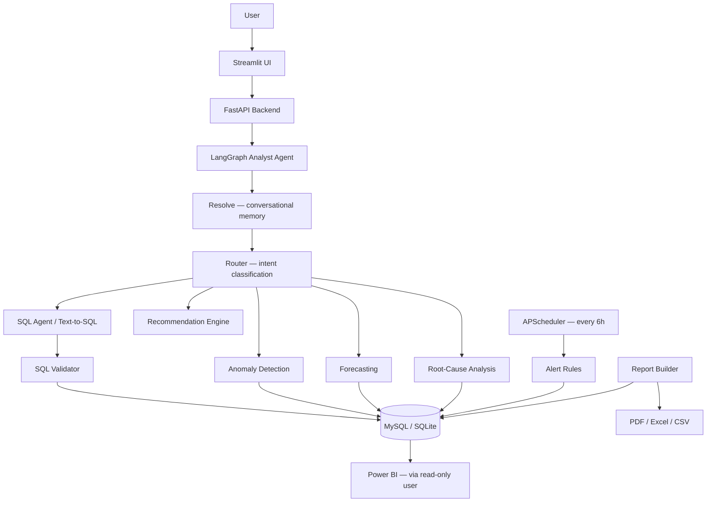

# AI-Powered-Data-Analyst-Dashboard
# AI Data Analyst Pro


**Ask your business data questions in plain English and get grounded SQL, charts, anomaly detection, forecasts, root-cause analysis, and recommendations — backed by a real LangGraph agent, not a hardcoded chatbot.**

> Try: *"Why did revenue decrease?"* → *"Which region caused it?"* (the second question reuses the first answer's context — see [Conversational memory](#conversational-memory))

---

## What's fully implemented vs. simplified (read this first)

This repo is a **working, tested MVP** covering every layer of the target
architecture — it is not the full 36-section production spec built out at
full depth in one pass. Honest scope:

**Fully implemented and tested:**
- Synthetic data generator with seeded, findable patterns (regional dip,
  return-rate spike, outlier day) — verified to run end-to-end
- SQL analytics layer (KPIs, monthly trends, regional/category/product breakdowns)
- SQL safety validator (allow-list SELECT/WITH, blocks writes, blocks
  multi-statement injection) — covered by tests
- Text-to-SQL with LLM (if `LLM_API_KEY` set) + a rule-based fallback that
  works with zero API cost/setup
- **Real LangGraph agent** (`app/agents/analyst_agent.py`) — a `StateGraph`
  with one node per intent (SQL lookup, root-cause, anomaly, forecast,
  what-if, recommendation) and a router node with conditional edges. Traced
  automatically in LangSmith if `LANGSMITH_API_KEY` is set.
- **Conversational memory** — the API returns an updated `context` dict
  after every question; the Streamlit UI persists it in `st.session_state`
  and sends it back on the next question, so follow-ups like "which region
  caused it" reuse the prior turn's data instead of recomputing from scratch
- Anomaly detection (Z-score + IQR + rolling deviation)
- Baseline forecasting (linear trend blended with recent level)
- RFM customer segmentation
- Churn risk model (RandomForest on heuristic labels — framed as directional,
  not certain, since synthetic data has no ground-truth churn)
- Data quality scoring
- **Alerts** — configurable rules (`app/alerts/rules.py`: revenue drop,
  margin floor, return-rate ceiling) evaluated automatically every 6 hours
  via APScheduler, plus a manual trigger and an alert-history page
- **Automated reports** — daily/weekly/monthly reports exportable as
  PDF (weasyprint), Excel (openpyxl), or CSV, with a download UI page
- **Power BI integration** — `powerbi/views.sql` (star-schema views) +
  `powerbi/README.md` (connection steps, model relationships, starter DAX
  measures that mirror the app's own business definitions)
- FastAPI backend + Streamlit multi-page frontend, wired together and tested live
- Pytest suite (18 tests, all passing)
- Dockerfiles + docker-compose (backend, frontend, MySQL)
- GitHub Actions CI (lint, format check, test, build)

**Simplified from the full spec (clearly marked in code comments):**
- Conversational memory is context-passing between turns (resolved via a
  `resolve` node that detects pronoun-style follow-ups), not a full
  vector-store or long-term memory system
- No read-only MySQL user wired into docker-compose yet (documented as a
  manual step in both the Security section below and `powerbi/README.md`)
- Default dataset size is smaller than the 10k/50k spec target (fast to seed
  for development) — pass `--customers 10000 --orders 50000` to seed full
  scale (note: the seeder uses ORM inserts, which will be slow at that
  scale — see "What to build next")
- Report periods (daily/weekly/monthly) currently all summarize the full
  history rather than windowing by the named period — the synthetic data
  doesn't have fine enough daily granularity to make a "daily" report
  meaningfully different yet

## Architecture



## Project structure

```
ai-data-analyst-pro/
  app/
    agents/        analyst_agent.py (LangGraph state machine), sql_agent.py, recommendation_agent.py
    tools/          sql_tool.py, chart_tool.py
    api/            routes.py
    database/       connection.py, models.py, queries.py, seed.py
    analytics/      metrics.py, rfm.py, anomaly.py, forecasting.py, churn.py
    validation/     sql_validator.py, data_validator.py
    alerts/         rules.py
    reports/        report_builder.py
    utils/          logger.py
    config.py, main.py
  ui/
    Home.py         Executive dashboard
    pages/          1_AI_Analyst.py, 2_Sales_Analytics.py, 3_Customer_Analytics.py,
                     4_Data_Quality.py, 5_Reports.py, 6_Alerts.py
  powerbi/          views.sql, README.md
  sql/schema.sql
  tests/            18 pytest tests
  .github/workflows/ci.yml
  Dockerfile.backend, Dockerfile.frontend, docker-compose.yml
  requirements.txt, .env.example
```

## Setup — fastest path (no Docker, no MySQL, SQLite)

```bash
cd ai-data-analyst-pro
python -m venv venv
source venv/bin/activate        # Windows: venv\Scripts\activate
pip install -r requirements.txt
cp .env.example .env            # defaults already point at SQLite

# generate synthetic data (defaults are small/fast; bump for full scale)
python -m app.database.seed --customers 2000 --products 150 --orders 12000

# terminal 1 — backend
uvicorn app.main:app --reload --port 8000

# terminal 2 — frontend
streamlit run ui/Home.py
```

Open `http://localhost:8501`. The backend API docs are at
`http://localhost:8000/docs`.

## Setup — Docker Compose (MySQL)

```bash
cp .env.example .env
# fill in MYSQL_USER / MYSQL_PASSWORD in .env
docker compose up --build
# then, in a new terminal, seed the MySQL instance:
docker compose exec backend python -m app.database.seed --customers 10000 --orders 50000
```

## Using an LLM for text-to-SQL (optional)

Set `LLM_API_KEY` (and optionally `LLM_MODEL`, default `gpt-4o-mini`) in
`.env`. Without a key, the app still works fully via the rule-based fallback
in `app/agents/sql_agent.py`.

## LangSmith tracing (optional)

Set `LANGSMITH_API_KEY` (and optionally `LANGSMITH_PROJECT`) in `.env`.
`app/config.py` sets the standard `LANGCHAIN_TRACING_V2` / `LANGCHAIN_API_KEY`
/ `LANGCHAIN_PROJECT` env vars for you — every LangGraph run then shows up in
your LangSmith project automatically, no code changes needed.

## Conversational memory — try it

In the AI Analyst page:
1. Ask "Why did revenue decrease?"
2. Follow up with "Which region caused it?" — the answer reuses the
   region/category breakdown from your first question instead of
   recomputing it, and says so explicitly.
3. "Clear memory" resets the conversation.

This works because the API's `/api/ask` response includes a `context` dict
that the Streamlit page stores in `st.session_state` and sends back on the
next request — see `resolve_node` in `app/agents/analyst_agent.py`.

## Example questions to try in the AI Analyst page

- "What was total revenue?"
- "Why did revenue decrease?" (root-cause across region/category)
- "Which region caused it?" (follow-up — uses conversational memory)
- "Find unusual sales behavior" (anomaly detection — will surface the seeded
  outlier day and the South-region August dip)
- "Forecast revenue for the next 3 months"
- "What happens if sales increase by 10%?"
- "Give me a recommendation to improve revenue"

## Alerts

Rules live in `app/alerts/rules.py`: revenue drop > 10% month-over-month,
profit margin < 15%, return rate > 15%. They run automatically every 6 hours
(`app/main.py`, via APScheduler) and can be triggered manually from the
Alerts page or `POST /api/alerts/check`. Triggered alerts are persisted to
the `alerts` table and viewable via `GET /api/alerts/history` or the Alerts
page.

## Reports

`GET /api/reports/{daily|weekly|monthly}` returns the report data as JSON;
`GET /api/reports/{period}/export/{pdf|xlsx|csv}` returns a downloadable
file. The Reports page in Streamlit wraps both. See "Simplified from the
full spec" above for the current period-windowing limitation.

## Power BI

See `powerbi/README.md` for full connection steps. Short version: run
`powerbi/views.sql` to create star-schema views, connect Power BI Desktop to
MySQL with a read-only user, and use `vw_fact_orders` as your fact table
against `vw_dim_customers` / `vw_dim_products`.

## Security

- The SQL validator (`app/validation/sql_validator.py`) is the only path
  between LLM-generated SQL and the database: allow-lists SELECT/WITH,
  rejects DROP/DELETE/UPDATE/INSERT/ALTER/TRUNCATE/CREATE, rejects
  multi-statement stacking, and enforces a row limit.
- No credentials are ever sent to the frontend; the frontend only talks to
  the FastAPI backend over HTTP.
- Use a read-only MySQL user for the app (and for Power BI — see
  `powerbi/README.md` for the exact `GRANT` statement) in any real
  deployment; not yet wired into `docker-compose.yml` by default.

## Testing

```bash
pytest tests/ -v
```

18 tests cover the SQL validator (safety-critical), KPI metrics, anomaly
detection, LangGraph intent routing, and alert rule thresholds.

## What to build next

1. Read-only MySQL grant wired into `docker-compose.yml` by default
2. Bulk-insert seeding (`sqlalchemy.insert()` Core statements instead of ORM
   objects) so 10k/50k+ scale seeds in seconds instead of minutes
3. Real per-period windowing for daily/weekly reports once data has that
   granularity
4. Token/cost tracking dashboard on top of LangSmith traces
5. A dedicated read-only MySQL grant + secrets manager for production deployment
